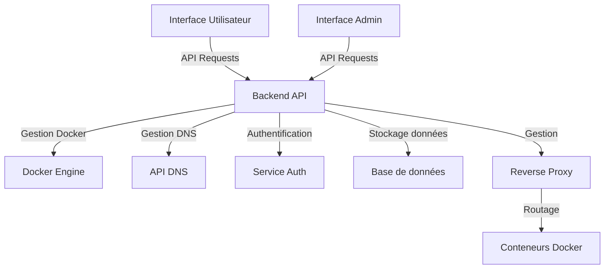

# Service d'Exécution de Conteneurs Docker 

Ce projet consiste en la création d'un service permettant aux utilisateurs de gérer des conteneurs Docker de manière simple et efficace. L'objectif principal est de fournir une interface intuitive pour lancer des conteneurs, les arrêter, les supprimer, et les rendre accessibles via des URLs personnalisées.

## Table des matières
- [Fonctionnalités](#fonctionnalités)
- [Architecture](#architecture)
- [Technologies Utilisées](#technologies-utilisées)
- [Licences](#licences)

## Fonctionnalités

- **Lancement de conteneurs** : Les utilisateurs peuvent fournir l'URL d'une image Docker ou un Dockerfile pour créer une image et lancer un conteneur.
- **Gestion des conteneurs** : Interface utilisateur pour lister, démarrer et arrêter les conteneurs en cours d'exécution.
- **Accès via URL** : Chaque conteneur est accessible par une URL personnalisée, gérée par l'utilisateur (ex. : `http://moncontainer34.ledomaine.ovh`).
- **Interface Admin** : Permet aux administrateurs de gérer les utilisateurs et les conteneurs, avec une vue d'ensemble sur l'état des conteneurs et la charge du serveur.
- **Gestion des ports** : Politique de liaison des ports pour permettre à plusieurs conteneurs de fonctionner simultanément sans conflit.
- **Sécurité** : Utilisation de JWT pour l'authentification, gestion des rôles, et audit des actions.

## Architecture

### Détails de l'architecture :

1. **Interface Utilisateur** : Application web pour que les utilisateurs gèrent leurs conteneurs (démarrer, arrêter, supprimer).
2. **Interface Admin** : Application web pour administrateurs, avec des fonctionnalités supplémentaires de gestion des utilisateurs et de supervision.
3. **Backend API** : Service principal, traitant toutes les requêtes des interfaces.
4. **Docker Engine** : Gestion des conteneurs.
5. **API DNS** : Gestion dynamique des noms de domaine des conteneurs.
6. **Service Authentification** : Sécurisation de l'accès via JWT.
7. **Base de données** : Stockage des informations utilisateurs, conteneurs, et logs.
8. **Reverse Proxy** : Routage dynamique des URLs vers les bons conteneurs.

## Technologies Utilisées

### Frontend
- **React.js** ou **Vue.js** : Interface dynamique et réactive
- **Tailwind CSS** : Styling moderne

### Backend
- **Node.js** avec **Express.js** ou **FastAPI (Python)** : Gestion des APIs
- **Docker SDK** : Gestion de Docker
- **JWT** : Sécurisation des sessions

### Base de données
- **PostgreSQL** ou **MongoDB** : Stockage des données persistantes

### Reverse Proxy
- **Nginx** ou **Traefik** : Routage dynamique

### Gestion DNS
- **API OVH** ou **Google Cloud DNS** : Attribution des noms de domaine

### Déploiement
- **Docker Compose** : Orchestration multi-services

## Licence

Ce projet est sous licence Apache 2.0. Pour plus d'informations, consultez le fichier [LICENSE](LICENSE).
